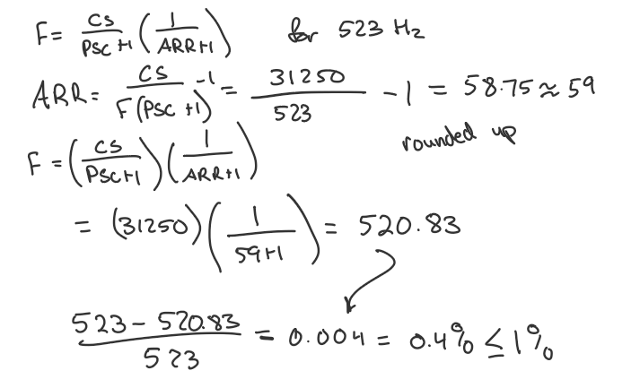
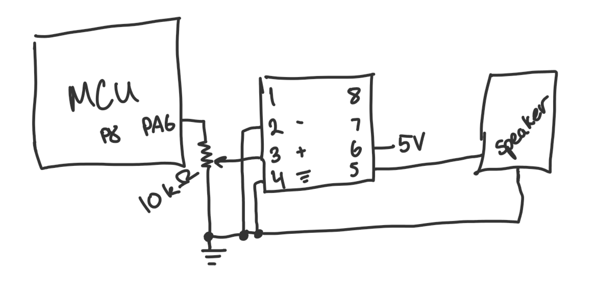

## Lab Overview
In this lab, the goal was to program an MCU to play a song by generating square waves with timers, outputting these to a speaker through an amplifier. Using C, the MCU reads pitch and duration for each note and drives the speaker with accurate tones. Additionally, the project requires configuring registers without pre-built headers to develop custom device drivers. The song I played on the speaker is "Für Elise." Further details can be found on the HMC E155 website under [Lab 4.](https://hmc-e155.github.io/lab/lab4/)

## Configuring Our System
The first step was to configure timers to control the pitch and duration of each note. This involved setting up TIM16 and TIM15 in C to output accurate signals. Each note was generated by toggling the output pin at a frequency corresponding to the desired pitch, using a list of provided pitches and durations. More information about the clock/timer setups can be found in the [MCU Reference Manual.](https://hmc-e155.github.io/assets/doc/rm0394-stm32l41xxx42xxx43xxx44xxx45xxx46xxx-advanced-armbased-32bit-mcus-stmicroelectronics.pdf)

In addition, I also wanted to make sure the outputted frequencies were accurate to within 1% of the original frequency. To do this, I reversed the ARR calculation as sampled in the image below which confirms our accuracy.

:::{.figure}

**Figure 1:** Diagram showing the process of determining timer frequencies for each note.
:::

With the timer configured, I wrote functions to set the output frequency and handle delays between notes, enabling playback at a steady tempo. The complete code is stored in [my repository](https://github.com/Jo90899/e155-lab4/tree/main).

# Hardware Setup and Circuit Design
After writing our code, I connected the MCU to a speaker by simply connecting it to the output pin PA6 and ground. Due to time constraints, I was unable to implement the amplifier into the speaker setup, however the amplifier connection would typically look something like this:

:::{.figure}

**Figure 4:** Schematic for connecting the MCU output to the speaker.
:::

# Audio Playback Results
With the hardware put together, I successfully programmed the MCU to play "Für Elise." Check it out!



# Summary
In this lab, we successfully used an MCU to produce digital audio and play a song. The key steps included configuring timers, generating square waves for each note, and debugging. On my first full attempt, I ran into an issue where my longer notes would not play fully and often sounded shorter than other (supposedly shorter) notes. After running through my code again, I realized I must have an issue with my prescaler being too small and overwriting due to overflow. After modifying this error, the song played smoother than before and almost perfectly. Overall, this lab took approximately 17 hours in total.