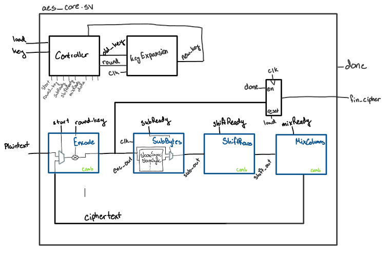
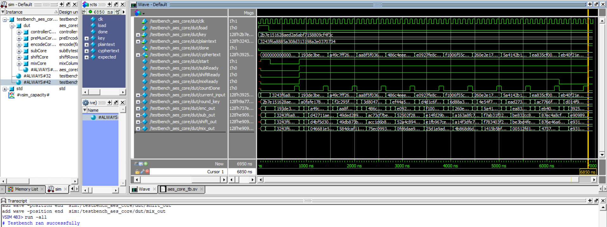
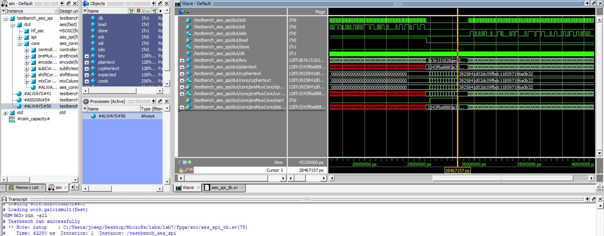

# Lab Overview
In this lab, the goal was to implement AES encryption on an FPGA by creating a hardware-accelerated AES core. A microcontroller sent plaintext and a key to the FPGA, which then processed and returned the encrypted result. This lab required designing the AES core to handle all encryption rounds, including key expansion and substitution operations, and involved debugging with SPI communication and logic analysis tools. Full lab instructions are available on the HMC E155 Website under [Lab 7.](https://hmc-e155.github.io/lab/lab7/)

# The Advanced Encryption Standard
The Advanced Encryption Standard (AES), is an encryption algorithm established by the National Institute of Standards and Technology (NIST) as a standard for securing data. AES encryption involves a series of transformations that increase the complexity of the data, making it extremely challenging to decipher without the correct key.

The main steps in the AES encryption process include Key Expansion, Initial Round, Main Rounds, and a Final Round:

1. **Key Expansion:** The original encryption key is expanded into multiple round keys using a specific algorithm. This is necessary because each round in the AES process uses a unique key.
2. **SubBytes:** Each byte in the block is replaced with another byte based on a lookup table called the S-box.
3. **ShiftRows:** The rows of the matrix are shifted by different offsets.
4. **MixColumns:** The columns of the matrix are mixed to further obfuscate the data.
5. **AddRoundKey:** This step simply applies an XOR to the inputted text and the key (for that round). At the start, it takes in the plaintext, but as the rounds continue, it applies the XOR to the cyphertext that results from the MixColumns step.

There are three different round types when performing AES:

1. **Initial Round:** This step involves a single AddRoundKey transformation, where the data block is XORed with the first round key.
2. **Main Rounds:** The middle rounds, where we apply SubBytes, ShiftRows, MixColumns, and AddRoundKey in that order.
3. **Final Round:** The last round is the same as the main rounds, without the MixColumns step.

To create this on my FPGA, I modeled the top diagram like a multicycle processor we had previously studied in E85. This led me to a final diagram that looked like this:

:::{.figure}

**Figure 1:** Top level design for the aes_core.sv file.
:::

Because of the way I modeled the top core module, I only needed one FSM in my controller module, which controled the rest of the design with enable pins. Initially, I created individual FSMs for each module, however this led me to many issues, including varying bit sizes when switching from combinational to sequential pieces of logic. Implementing the processor-style design greatly simplified my debugging process, as I only needed to focus on one state machine.

From here, I was able to write my SystemVerilog in Radiant. See that code [here.](https://github.com/Jo90899/e155-lab7/tree/main)

# Questa/ModelSim Testing
Our testbenches for this lab were provided for us and they were used to make sure that the AES was properly implemented and that the communication between the FPGA and MCU was done correctly with SPI. Below are two screenshots indicating that these testbenches ultimately were successful and that my AES is properly implemented.

:::{.figure}

**Figure 2:** Successful test for aes_core module.
:::
:::{.figure}

**Figure 3:** Successful test for aes_spi module.
:::

If you look closely, you can see that the results for the "expected" and "plaintext" in the waveforms are the same, or you can look to the bottom where the console notes that the testbench ran successfully. 

# Summary
Overall, after switching my process to work like a multicycle processor, the biggest issue I ran into was an error with my round-counting. After reshuffling my code into the new form, I had a mismatch that was difficult to find, where I sometimes initialized the first round as round=0 and other times as round=-1. To find this, I compared the testbench with the [datasheet's](https://hmc-e155.github.io/assets/doc/NIST.FIPS.197-upd1.pdf) example encryption in the appendix. Doing this allowed me to pinpoint where my error was located and eventually fix it.

In sum, I was able to create a working AES encryption module on an FPGA that communicated through SPI with an MCU. Reorganizing and re-evaluating my process helped me to understand the attractiveness of a theoretically more complex design, as it leaves room for easier implementation in some cases. In total, this lab took me about 16 hours to complete.
